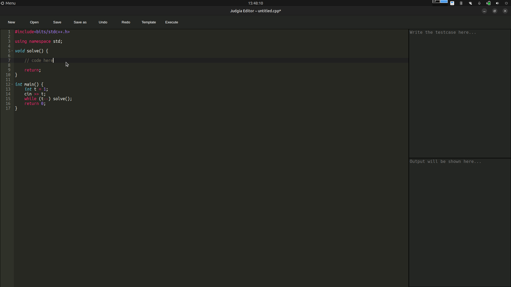

# Judgia Editor
An editor specially for competitive programming with C++



## Development
```bash
npm install
npm run dev
```

## Build for Linux
```bash
npm run build:linux
```

# License
Copyright (c) 2025 MohammadAli Arjomand.
Licensed under [GPL-3.0 license](LICENSE)
